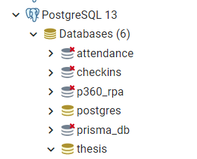
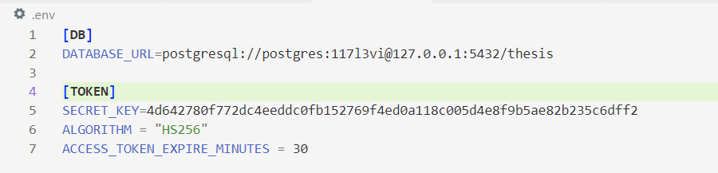
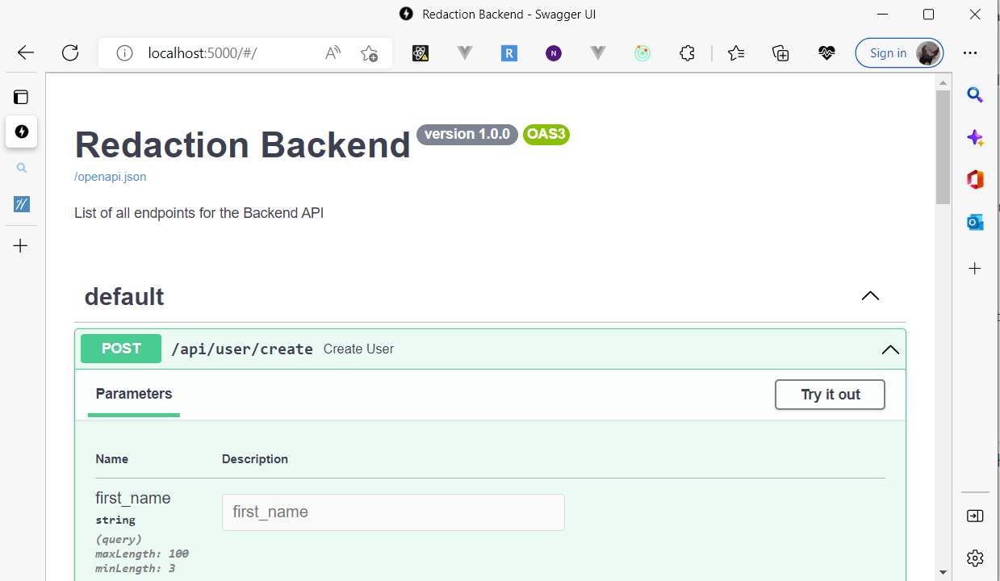

# model_api
Model Repo and API for our thesis dissertation

## Setup and Installation of DB
First and foremost, setup a database from postgres. If you haven't downloaded postgres yet, please install for the local setup.



This is how the schema looks likefrom my DB podtgres. But what you need essentially is just the create the thesis schema and then after creating it, we will be setting up our `.env` and `alembic.ini`
 
This is how my `.env` file looks like:


```
[DB]
DATABASE_URL=postgresql://<dbuser>:<password>@127.0.0.1:5432/<schema>

[TOKEN]
SECRET_KEY=4d642780f772dc4eeddc0fb152769f4ed0a118c005d4e8f9b5ae82b235c6dff2
ALGORITHM = "HS256"
ACCESS_TOKEN_EXPIRE_MINUTES = 30
```

These values especially for the DB is gathered in our psql credentials where our schema, `thesis` is located.

Next is our `alembic.ini` file. Our file is fine as is, what you need to change is essentially the `sqlalchemy.url`. It should have the same format as our database string above.

`sqlalchemy.url = postgresql://<dbuser>:<password>@127.0.0.1:5432/<schema>`

after setting this up, we will be likely running these commands to migrate and check our connection

<b>NOTE:</b> Plese make sure to run requirements.txt for the newly added libs. Alembic is part of it and we need this to run the commands stated here.

### For creating new migrations from code.
<b>NOTE:</b> Only run this if you added another change to our coded model

`python3 -m alembic revision -m <message>`


### For running migrations from code.
To apply the generated migration script from above, run:

`python3 -m alembic upgrade head`

After these lines are run, make sure to test and setup the roles to populate by running:

`python3 -m init_role.py`

## Running the App
To run the app, we need to execute the following command:

`python3 -m main.py`

our main file already setup uvicorn so no need to setup uvicorn command to run it. This will be the output



Here we see that we have a pregenerated swagger ui with the list of our APIs

## Other References
For mac but just change the poetry thingy to what is indicated in our commands
https://harrisonmorgan.dev/2021/02/15/getting-started-with-fastapi-users-and-alembic/
